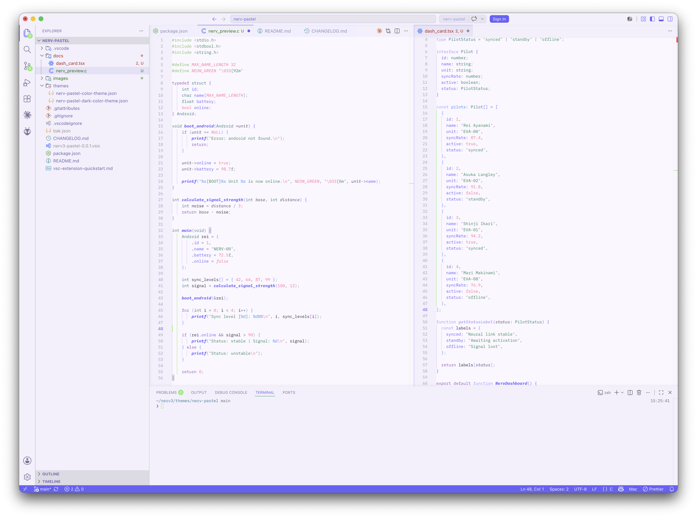
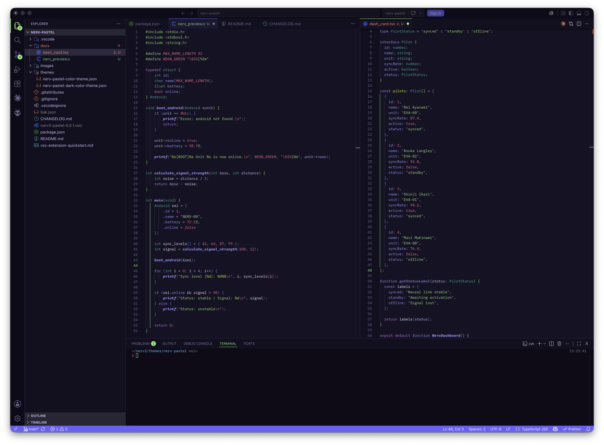

# Nerv3 Pastel

Nerv3 Pastel is a soft cyberpunk-inspired theme for Visual Studio Code, designed for people who like expressive colors without sacrificing readability.

It combines pastel surfaces, neon accents and carefully balanced syntax colors to create a comfortable coding experience in both light and dark environments.

## Previews

### Nerv3 Pastel Daylight

  

### Nerv3 Pastel Shadowrun

  

## Themes included

This extension includes two themes:

- Nerv3 Pastel Daylight — a light theme with a soft lavender background and neon pastel accents.
- Nerv3 Pastel Shadowrun — a dark version with deep purple surfaces and bright cyberpunk highlights.

## Design concept

Nerv3 Pastel was created around a simple idea:

> A theme can feel futuristic without being visually aggressive.

Instead of using a pure white background for the light version, Nerv Pastel uses a soft lavender base that reduces visual harshness. The dark version keeps the same visual identity, but shifts the interface into deep purple and near-black tones.

The palette uses colors inspired by cyberpunk interfaces, neon signage and soft UI systems:

- soft lavender backgrounds;
- electric violet accents;
- neon green highlights;
- saturated blue functions;
- pink/red constants and errors;
- muted comments;
- readable foreground contrast.

## Features

- Light and dark variants.
- Custom workbench/interface colors.
- Custom editor background, gutter, tabs and panels.
- Custom terminal colors.
- ANSI terminal palette included.
- Semantic token support.
- TextMate syntax token support.
- Bracket pair color customization.
- JSON/JSONC-specific token colors.
- HTML, CSS, JavaScript, TypeScript and general language token support.

## Installation

### From the Visual Studio Code Marketplace

1. Open Extensions in VS Code.
2. Search for Nerv Pastel.
3. Click Install.
4. Open the Command Palette with:

txt Cmd + Shift + P 

5. Select:

txt Preferences: Color Theme 

6. Choose either:

txt Nerv Pastel 

or:

txt Nerv Pastel Dark 

### Manual installation from VSIX

If you have the .vsix file:

1. Open VS Code.
2. Open the Command Palette:

txt Cmd + Shift + P 

3. Run:

txt Extensions: Install from VSIX... 

4. Select the .vsix file.

Or install via terminal:

bash code --install-extension nerv-pastel-theme-0.0.1.vsix 

## Recommended settings

For the best experience, especially with brackets and indentation guides, you can use:

jsonc {   "editor.bracketPairColorization.enabled": true,   "editor.guides.bracketPairs": true,   "editor.guides.indentation": true } 

These settings are optional, but they help preserve the intended visual rhythm of the theme.

## Color philosophy

Nerv3 Pastel is not intended to be a minimal monochrome theme. It is expressive, but controlled.

The light version avoids pure white and uses a soft pastel background to reduce glare. The dark version avoids flat black and uses a layered purple-toned interface.

Syntax colors are grouped by visual function:

| Token type | Visual direction |
|---|---|
| Strings | Green tones |
| Functions | Blue/violet tones |
| Classes | Violet tones |
| Numbers | Pink/red tones |
| Booleans | Pink/red tones |
| Comments | Muted lavender gray |
| Constants | Bright accent colors |
| Keywords | Purple tones |
| Terminal accents | Green/violet cyberpunk palette |

## Included themes

### Nerv3 Pastel Daylight

A soft light theme with:

- pastel lavender editor background;
- bright green cursor;
- violet active tabs;
- custom terminal palette;
- soft sidebar and panel surfaces;
- colorful but readable syntax.

### Nerv3 Pastel Shadowrun

A darker version with:

- deep purple editor background;
- neon green active highlights;
- cyberpunk terminal palette;
- saturated syntax colors;
- high-contrast foregrounds;
- cohesive relation with the light theme.

## Accessibility notes

Nerv Pastel was designed with readability in mind, but color perception varies from person to person and from screen to screen.

If a specific token color does not work well for your setup, you can override it in your personal VS Code settings.json using:

jsonc {   "workbench.colorCustomizations": {},   "editor.tokenColorCustomizations": {},   "editor.semanticTokenColorCustomizations": {} } 

## Feedback

Feedback, suggestions and issues are welcome.

You can open an issue in the repository if you find:

- low-contrast syntax in a specific language;
- an unstyled UI area;
- terminal color problems;
- inconsistencies between the light and dark variants.

## Known notes

Some colors may vary depending on:

- the programming language;
- semantic highlighting support;
- installed language extensions;
- personal VS Code overrides;
- terminal shell or CLI tools.

For best results, make sure there are no old theme overrides in your settings.json while testing.

## License

MIT License

Copyright (c) 2026

Permission is hereby granted, free of charge, to any person obtaining a copy
of this software and associated documentation files, to deal in the Software
without restriction, including without limitation the rights to use, copy,
modify, merge, publish, distribute, sublicense, and/or sell copies of the
Software, subject to the following conditions:

The above copyright notice and this permission notice shall be included in all
copies or substantial portions of the Software.

THE SOFTWARE IS PROVIDED "AS IS", WITHOUT WARRANTY OF ANY KIND, EXPRESS OR
IMPLIED, INCLUDING BUT NOT LIMITED TO THE WARRANTIES OF MERCHANTABILITY,
FITNESS FOR A PARTICULAR PURPOSE AND NONINFRINGEMENT. IN NO EVENT SHALL THE
AUTHORS OR COPYRIGHT HOLDERS BE LIABLE FOR ANY CLAIM, DAMAGES OR OTHER
LIABILITY, ARISING FROM, OUT OF OR IN CONNECTION WITH THE SOFTWARE OR THE USE
OR OTHER DEALINGS IN THE SOFTWARE.